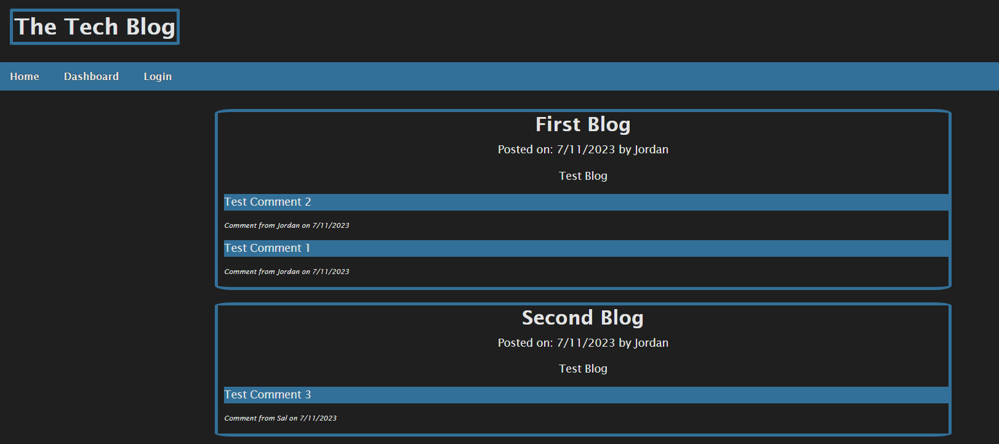

# Tech_Blog
Tech blog site. Express/Sequelize back-end with Handlebars.js front-end.

## Description

Blog site with user logins allowing for posting blogs and commenting on others'

## Usage

User are presented with homepage displaying any existing blogs and their respective comments.
A navigation menu presents options for 'Home', 'Dashboard', & 'Login'.
Navigating to either the Dashboard or Login page will present users with an option to signup or login.
Either option will return users to the homepage. Buttons for adding comments to posts will now be enable.
The Dashboard will now be available with options for creating posts, editing existing posts, or deleting posts.
An option to logout will replace the login option on the navigation menu.
Users remain logged until logging out manually or letting the session time out.

GitHub Repository can be found here:

https://github.com/creechj/Tech_Blog

## Credits

Sequelize queries:
https://sequelize.org/docs/v6/advanced-association-concepts/eager-loading/

onClick id retrieval (user: potashin):
https://stackoverflow.com/questions/27842138/get-id-of-parent-element-on-click

Page refresh:
https://stackoverflow.com/questions/29884654/button-that-refreshes-the-page-on-click

jass.css for normalizing:
https://github.com/necolas/normalize.css

textarea parameters:
https://developer.mozilla.org/en-US/docs/Web/HTML/Element/textarea

forEach with querySelector for comment button display (user: Allen):
https://stackoverflow.com/questions/33178114/using-queryselectorall-to-change-the-style-property-of-multiple-elements

## License

Please see license in repository for this application